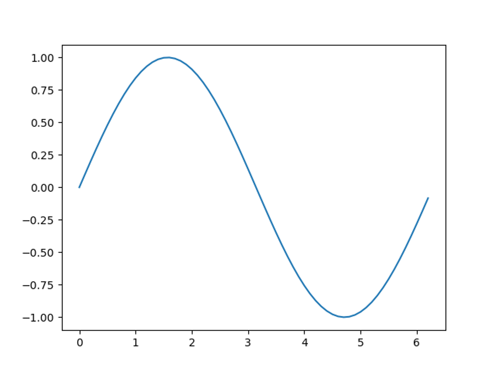

## Directions for installing Python on Windows:

1.	Download the latest version of python [https://www.python.org/downloads/](https://www.python.org/downloads/).   
a.	Run the executable making sure to check the box at the bottom for `Add Python 3.8` to the path, then click `install now`.  
b.	Once it is done installing on the final page of the installer make sure to disable the path length limit

2.	Now either press the windows key or click on the start menu and type cmd and press enter.   
a.	In the cmd type: `pip3 install numpy scipy matplotlib`    
b.	If the terminal says no such program pip3 exists then you didn't add the path on the python install appropriately so you will need to reinstall python and make sure to add the path and disable the default path length limit

3.	  Download atom [https://atom.io/](https://atom.io/).  
a.	Run the executable
b.	Click on `File > Settings > Install` then type `script` and install that, this allows you to execute code in atom by pressing `ctrl+shift+b`.

4.	Open a new file.     
   a.	Enter the following in the file  
   >Test script
   
	```python 
	import numpy as np
	import matplotlib.pyplot as plt
	from scipy.special import exp10
	
	def main():
   		a = np.arange(3)
   		print(a)
    	t = np.arange(0, 2*np.pi, 0.1)
    	y = np.sin(t)
    	exp = exp10([1,10])
    	print(exp)
    	plt.plot(t, y)
    	plt.show()
	
	# Function that python needs to run the main function
	if __name__ == '__main__':
	main()
	```   
	
	b.	Remember spacing matters in python  
	c.	Save the file with `ctrl+s`   
	d.	Run the file with `ctrl+shift+b`  

	e.	The output should be this

		1.	[0 1 2]  
		2.	[1.e+01 1.e+10]  
		3.	Along with the figure  

	

	f.	If all things were done correctly this should run and utilize the three libraries for this class.


5.	If you would like for ease of access you could create a folder specifically for class code and path to there in atom so that way you don't need to remember the default installation area of atom and its files.
